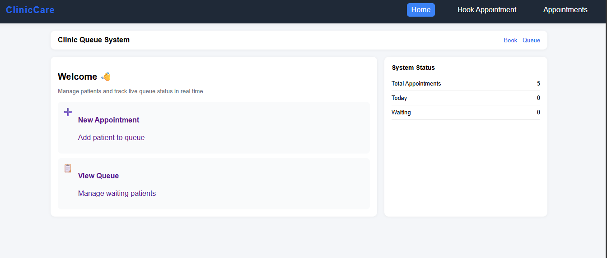
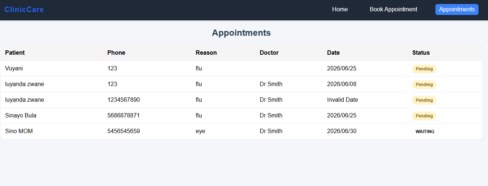
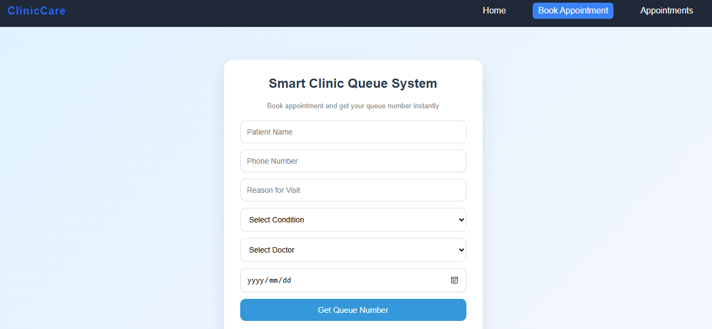

Clinic Management System

This is a simple Clinic Management System that I built as a full-stack project. The aim of the project is to help manage basic clinic activities like patients and appointments.

What the project does

The system allows users to add and manage patient details, book appointments, and handle basic clinic operations. It connects a frontend interface with a backend server to store and manage data.

Tools and technologies used

Frontend:

React
Vite
JavaScript
CSS

Backend:

Spring Boot
Java
Maven
How to run the project

To run the backend, go into the BACKEND folder and start the Spring Boot application.

To run the frontend, go into the FRONTEND folder, install dependencies using npm install, then start the development server using npm run dev.

Project structure

The project is divided into two main parts:

BACKEND (server-side logic)
FRONTEND (user interface)
Future improvements

## Screenshots

### Home Page

### Appointment Page

### Booking Page

There are still a few improvements that can be made such as adding user login, improving the UI, and adding more advanced features like medical records and reports.

Author

Bontle
